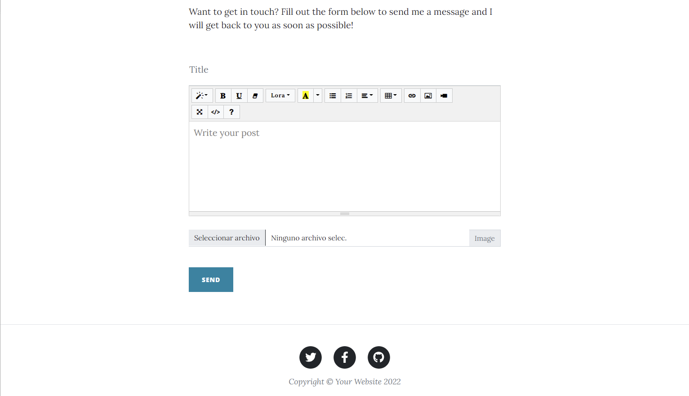
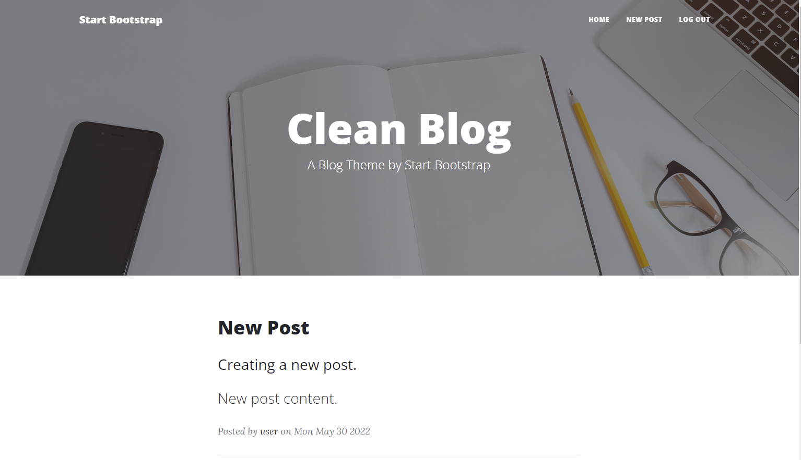

# FullStack - NodeJS, Express, MongoDB Blog Application

This is a FullStack application that allows users to make posts, read posts, register a new account, login and logout, the main FrontEnd of this app was taken from a StartBootstrap template.

A deployed version of this app is provided hosted on Heroku and using MongoDB Atlas as the cloud based service for the database. 
- Live Site URL: [Live Site URL](https://rravg-clean-blog-app.herokuapp.com)

## Table of contents

- [Overview](#overview)
  - [Screenshot](#screenshot)
  - [Links](#links)
- [My process](#my-process)
  - [Built with](#built-with)
  - [Useful resources](#useful-resources)
- [Author](#author)

## Overview

Users should be able to:

- View the optimal layout for the app depending on their device's screen size.
- See hover states for all interactive elements on the page.
- Create and Read posts.
- Register a new account with unique username and able to login.
- Logout of their accounts.

### Screenshot

### Links

- Solution URL: [Source Code Solution](https://github.com/Rravg/blog-app)
- Live Site URL: [Live Site URL](https://rravg-clean-blog-app.herokuapp.com)

## My process

### Built with

- Semantic HTML5 markup
- Bootstrap 5
- Summernote
- NodeJS
- Express
- MongoDB

### Useful resources

- [Template Link](https://startbootstrap.com/theme/clean-blog) - The FrontEnd of this app was taken from a StartBootstrap free template

## Author

[Rodrigo Alexander Villalobos]()
